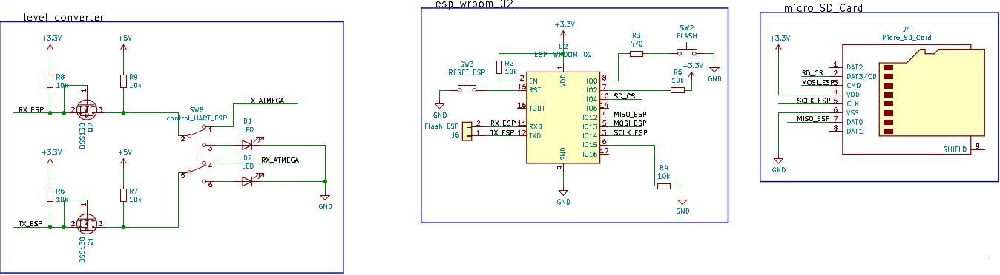
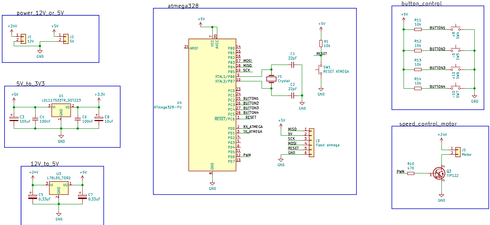
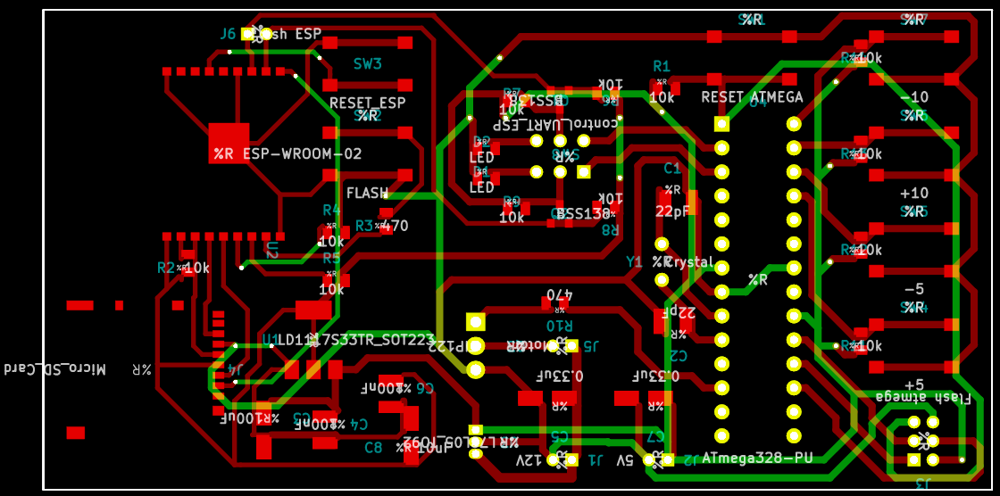
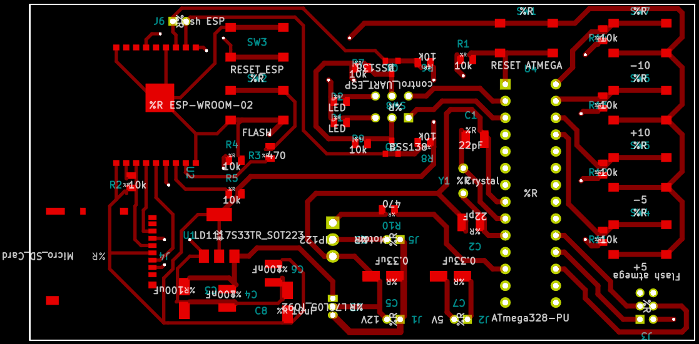
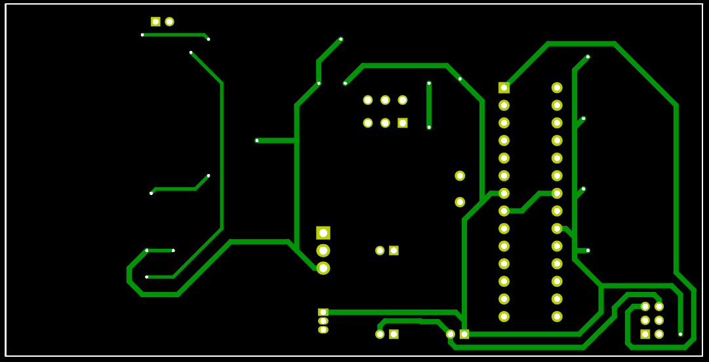

# motor-speed-controller
This is my answer for job test for Electrical Embedded Engineer position from a company. The task is to make motor speed controller used ATMega 328, and trasnfer the data to ESP wroom 02 to save in microSD card and web server

# Schematic Design
 
Or you can see the PDF in folder `Schematic`

# PCB Design
### Design for all layer

### Design for top layer

### Design for bottom layer

# Firmware
For firmware, I used Arduino programming to both of the microcontroller